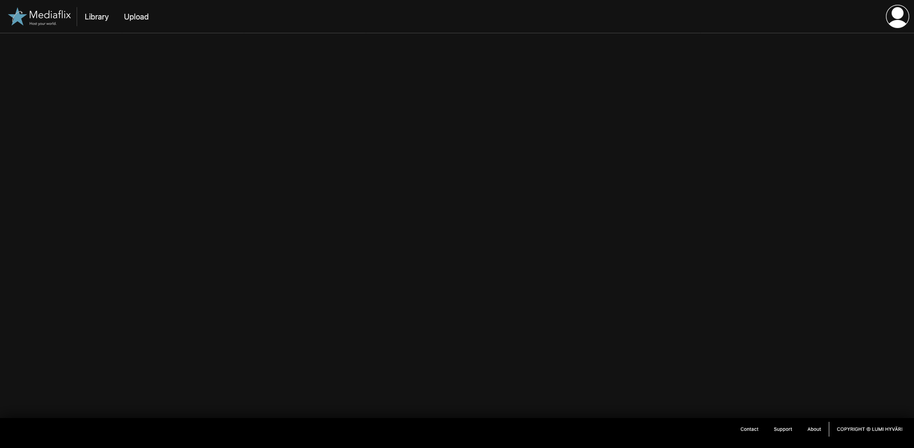

> [!NOTE]
> This project started 6 may 2026 and is still early work-in-progress.

# Mediaflix
Open-source self-hosted and easily deployable media streaming service.



# Packages
Mediaflix uses the following packages:

```
"bcrypt": "^6.0.0",
"body-parser": "^2.2.2",
"dotenv": "^17.4.2",
"express": "^5.2.1",
"express-session": "^1.19.0",
"morgan": "^1.10.1",
"mysql": "^2.18.1"
```

# Configuration
## Basic configuration
To configure the logging and network set up use the existing `settings.json` file and update its key-value fields accordingly.

## Secret variables
To configure database credentials and other sensitive variables create and use a `.env` file located at the repository root. Within this dot file you should add the following variables:

```
PGHOST='<database-host-address>'
PGDATABASE='<database-name>'
PGPORT=<database-port>
PGUSER='<database-user>'
PGPASSWORD='<user-password>'
PGSSLMODE='require'
PGCHANNELBINDING='require'
```

# Deployment
## Docker multi-containers
Mediaflix has a docker configuration set up for easy deployment and scaling. Simply install docker on your system and execute the following command: `docker compose up`.